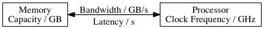
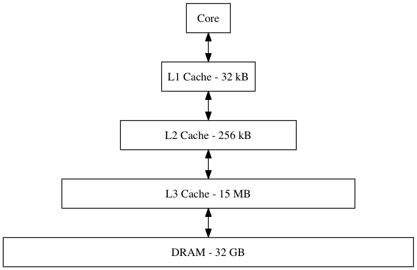
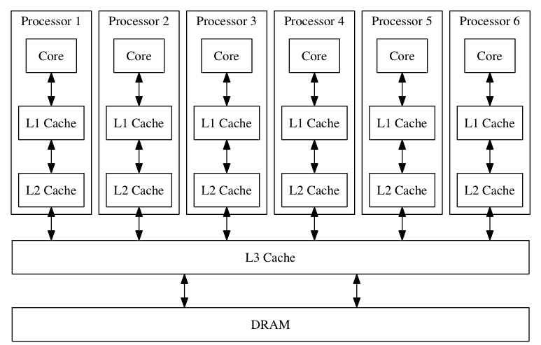

Understanding Hardware Performance
===

Richard Rollins
github.com/rprollins/jacs-hardware


---

# Overview

- Hardware Trends
- Roofline Performance Model
- Memory Heirachy
- Benchmarks

---

# Examples

The examples use the Google Benchmark library (github.com/google/benchmark). 

To build the examples you should clone the repository and invoke the Makefile:

```bash
git clone git@github.com:rprollins/jacs-hardware.git
cd jacs-hardware
make all
```

The benchmarks were compiled with GCC 6.2.0 and run on an Intel Xeon Processor E5-1650 v4 3.60 GHz 6-core processor.

---

# References

- Computer Architecture: A Quantitative Approach - 
Hennessy & Patterson
- Roofline: An Insightful Visual Performance Model for Multicore Architectures - Williams, Waterman & Patterson
- Want Fast C++? Know Your Hardware! - Timur Doumler CppCon 2016 (youtu.be/a12jYibw0vs)

---

# Moore's Law

Fill in the blanks:

_____ doubles every _____ months?

---

# Moore's Law and Denard Scaling

- Moore's Law: Observation that the transistor density of integrated circuits approximately doubles every 2 years.

- $RC$ time constant is porportional to physical size, so smaller transistors can switch at higher frequencies $f$.

- Transistor Power Consumption: $P \approx CV^2f + I_LV$

- Denard Scaling: Transistor power density is "constant". Since 2005 this is no longer true; below 65nm non-linear leakage currents ($I_L$) and threshold voltage lead to a "power wall".

- New processors are not faster, but more parallel.

---

# Hardware Trends


---

# CPU Die


- Cores: Processor registers & local caches
- Memory Controller: Access to DRAM
- Access to peripherals (storage, network etc)

---

# Instruction Level Parallelism - Pipelining


---

# Instruction Level Parallelism - SIMD


- SISD: Single instruction stream, single data stream
- SIMD: Single instruction stream, multiple data streams

---

# Example 1: Stream Benchmark

A set of benchmarks for the memory bandwidth of vector operations (www.cs.virginia.edu/stream/). Which is faster?

```
size_t N = 4096;
std::vector<double> a(N), b(N), c(N);
double q;

// BM_Add
for(size_t i=0; i<N; i++) a[i] = b[i] + c[i];
// BM_Triad
for(size_t i=0; i<N; i++) a[i] = q * b[i] + c[i];
```

---

# Example 1: Stream Results

| Benchmark | Time    | Iterations  |
| ----------|--------:| ------------:|
| <span style="color:green">BM_Add</span>    | <span style="color:orange">1441 ns</span> | <span style="color:blue">352206</span>       |
| <span style="color:green">BM_Triad</span>  | <span style="color:orange">1404 ns</span> | <span style="color:blue">473725</span>       |

How can we understand the observed performance in terms of the computer architecture?

---

# A Model for Computation, Communication and Locality



Performance measured in FLOPS: Floating-Point Operations Per Second

---

# Roofline Performance Model

Peak performance falls into two regimes depending on the arithmetic intensity: communication-bound and compute-bound.

$$\text{Performance} = \text{min} \begin{cases}
   \text{Peak Flop Rate}\\
   \text{Bandwidth}\times\text{Flop:Byte Ratio}
\end{cases}$$

crd.lbl.gov/departments/computer-science/PAR/research/roofline

---

# Arithmetic Intensity

A measure of data reuse for a given computer program given by the ratio of the number of floating-point operations to the volume of memory accesses. 


---

# Roofline Performance Model

Three regimes for performance optimisation: in-core, memory throughput and data reuse:


---

# Example 1: Stream Benchmark

- How long to read data? Data Volume / Memory Bandwidth.
- How long to do arithmetic? Flop Count / Clock Frequency.
- The time to complete the aritmetic operations is negligible compared to the time to read the arrays from memory.
- Arithmetic intensity is low so the loops are memory bound. 

---

# The Processor - Memory Gap


---

# Example 2: Array Size

``` c++
// BM_Triad
size_t N;
std::vector<double> a(N), b(N), c(N);
double q;
for(size_t i=0; i<N; i++) a[i] = q * b[i] + c[i];
```

How does runtime depend on the array size N?

---

# Example 2: Array Size


---

# Memory Heirachy


- Memory "closer" to the processor tends to have higher bandwidth and lower latency for read/write access.
- Memory "further" from the processor tends to have greater capacity and may be non-volatile.


---

# Memory Heirachy



---

# Example 2: Array Size


---

# Example 2: Array Size


---

# Example 3: OpenMP Stream

``` c++
// BM_Triad_OpenMP
size_t N;
std::vector<double> a(N), b(N), c(N);
double q;
#pragma omp parallel for
for(size_t i=0; i<N; i++) a[i] = q * b[i] + c[i];
```

OpenMP: shared-memory multiprocessing of loops and tasks.
How does parallelising the scale benchmark affect runtime?

---


# Example 3: OpenMP Stream


---


# Multicore Memory Heirachy



---

# Example 4: Vector vs List

```c++
// BM_Vector
std::vector<double> a(N), b(N);
std::copy(a.begin(),a.end(),b.begin());

// BM_List
std::list<double> c(N), d(N);
std::copy(c.begin(),c.end(),d.begin());
```

Is the vector loop faster or slower than the list loop?

---

# Example 4: Vector vs List

|Benchmark | Time    | Iterations  |
| ----------|--------:| ------------:|
| <span style="color:green">BM_Vector</span> | <span style="color:orange">1130 ns</span> | <span style="color:blue">595552</span> |
| <span style="color:green">BM_List</span> | <span style="color:orange">8807 ns</span> | <span style="color:blue">77921</span> |

---

# Example 4: Vector vs List


Each node in a linked list stores both data and the address of the next node in memory. The time taken to read successive nodes is limited by the memory latency.

Arrays store data contiguously in memory. Modern processors *prefetch* successive elements using the full memory bandwidth. 

---

# Example 5: Stride

```
// BM_Stride
std::vector<double> a(N); // 16MB
for(size_t i=0; i<N; i+=stride) { a[i]++; }
```

Strided access of the data in vector a. How does the performance vary with stride size?

---

# Example 5: Stride


---

# Cache Lines


- Cache's cannot read in individual bits from RAM. They can only read (64B) cache lines. 
- For strides less than the cache line size, all data is  read.
- For strides larger than the cache line size, not all data is read.

---

# Cache Line Invalidation and False Sharing


---

# Example 6: Stride

```
// BM_Stride
std::vector<double> a(N); // 16MB
size_t repeat = 10000;
size_t i = 0;
for(size_t r=0; r<repeat; r++)
{
  a[i]++;  
  i = (i + stride) % N;
}
```

Operate on a fixed number of elements in the vector a, but taking strides of different sizes. How does the performance vary with stride size?

---

# Example 6: Stride


---

# Cache Associativiy


---

# Memory Optimisation Strategies

- Can I shrink / divide the problem size?
- Can I use contiguous arrays?
- Can I change the data access pattern?
- Can I improve data reuse?